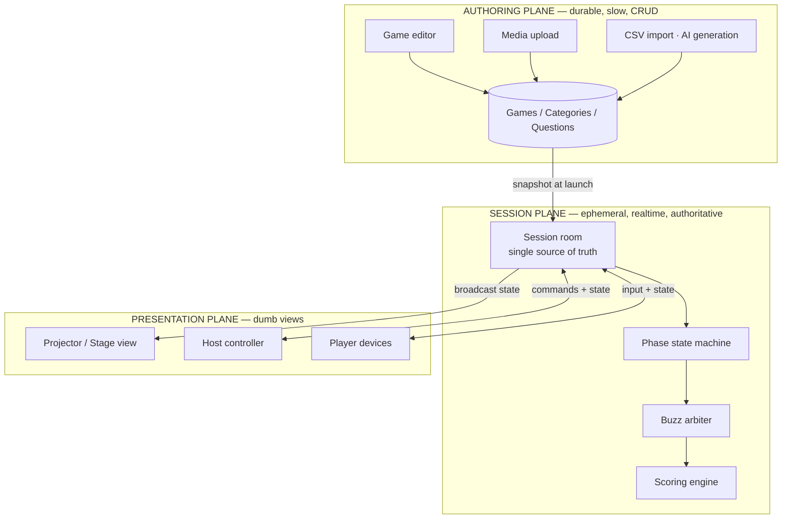
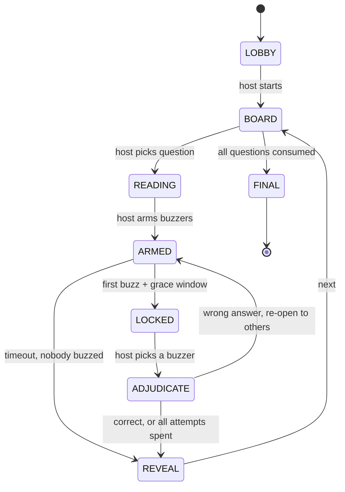

# Game Show Software — Architecture Teardown & Build Plan

> Reverse-engineered from TriviaMaker (verified against the live site, August 2026),
> re-scoped for a **single live student council game show**.
>
> Read §10 first if you're short on time. Everything before it is the "how it works";
> §10 is the "what you should actually build."

---

## 0. TL;DR

- TriviaMaker's real architecture is **two orthogonal axes**: *game style* (the board/format) × *play mode* (how players participate). Seven styles × four modes, not 28 separate products.
- The hard engineering is **not** the quiz logic. It's the **live session runtime**: one authoritative room, many transient clients, a strict phase state machine, and fair buzz ordering under variable network latency.
- For **one stage event**, ~90% of the SaaS is dead weight. The irreducible core is: a question board, a projector view, a host controller, a scoreboard, and an undo button.
- **Hard architectural rule for live events:** the presenter view must be 100% playable with zero players connected. Player devices are an *enhancement*, never a dependency. Venue wifi will fail. Design so the show goes on.

---

## 1. What TriviaMaker Actually Is

A browser-based **authoring tool + live host runtime**. No install. Host builds a game, launches a session, audience joins by 6-digit code or QR, host drives the board on a projector.

### 1.1 Game styles (the board format)

| Style | Format | Scoring shape | Cloneable in |
|---|---|---|---|
| **Grid** | Jeopardy board — categories × point values (100–1000) | Team scoring, host-awarded | ~1 day |
| **List** | Family Feud — survey list, reveal slots | Group scoring, buzz-in | ~1 day |
| **Trivia** | Multiple choice | Live/speed scoring | ~4 hrs |
| **Wheel** | Spin to select category/question | Random order | ~4 hrs |
| **Tic Tac** | Tic-tac-toe board, win a square by answering | Turn-based | ~1 day |
| **Hangman** | Word guessing, untimed | Letter-by-letter | ~1 day |
| **Fusion** | Multiple styles chained in one session | Mixed | composition only |

### 1.2 Play modes (how the audience participates)

| Mode | Player devices? | Who judges? | Scoring |
|---|---|---|---|
| **Presenter** | No (or optional) | Host, manually | Host awards points |
| **Crowd** | Yes, everyone answers | Auto | **Speed-weighted** — faster correct answer = more points |
| **Classroom** | Yes, per student | Auto | Speed-weighted, per-student |
| **Buzz** | Yes, tap to buzz | Host picks from top-3 buzzers | Host awards after adjudication |

### 1.3 The key insight — the axes are orthogonal

This is the single most important thing to copy:

```
                 PLAY MODE
              Presenter  Crowd  Classroom  Buzz
GAME   Grid  |    ✓        ✓        ✓       ✓
STYLE  List  |    ✓        ✓        ✓       ✓
       Trivia|    ✓        ✓        ✓       ✓
       Wheel |    ✓        ✓        ✓       -
```

A **style** owns: what the board looks like, how a question is selected, what "a turn" means.
A **mode** owns: where input comes from, who adjudicates, how points are computed.

If you fuse these two concerns into one component, you will write the same scoring
code six times and the same board code four times. Keep them as separate interfaces
and adding a style is a day, not a week.

> TriviaMaker gates on capacity, not features: Free = 20 participants / 3 styles;
> paid tiers step 50 → 200 → 2000 participants. Capacity is the monetization axis
> because the feature surface is genuinely small. Irrelevant to you — noted only
> because it explains why their architecture prioritizes connection scaling.

---

## 2. The Three-Plane Architecture

Every product in this category decomposes the same way. Keep these planes physically
separate in your codebase — they have different lifetimes, different consistency
needs, and different failure modes.



### Plane 1 — Authoring (durable)

Ordinary CRUD. A `Game` is a **template**. Postgres, SQLite, or honestly a JSON file.
No realtime, no concurrency problems, edited by one person on a laptop days before.

### Plane 2 — Session (ephemeral + authoritative)

A `Session` is one **live run** of a Game. This is where all the difficulty lives.
Critical design decision: **snapshot the game content into the session at launch.**

Never have the live runtime read from the authoring tables mid-show. If someone
opens the editor during the event and saves, you do not want the board mutating on
stage. Copy the questions in at launch time and freeze them.

### Plane 3 — Presentation (dumb)

Three views, all pure functions of session state. No view holds authoritative state.
No view computes a score. If a view has business logic in it, you'll get
desyncs — the projector saying one thing and the host's laptop another, live, on
stage, in front of everyone.

---

## 3. Roles & Screens

| Screen | Device | Sees | Can do |
|---|---|---|---|
| **Stage / Projector** | Laptop → HDMI | Board, current question, timer, scoreboard, buzz results | Nothing. Read-only. |
| **Host Controller** | Phone/tablet/2nd laptop | Question **+ the answer**, buzz queue, score controls | Select question, arm buzzers, reveal, award/deduct, undo, next |
| **Player** | Own phone | Join screen → buzz button / answer choices | Buzz, answer, nothing else |
| **Scorekeeper** *(optional)* | 3rd device | Scoreboard editor | Manual score correction |

**Separation of stage and control is non-negotiable.** The host must see answers the
audience must not. If you run both off one screen you will mirror the answer key onto
the projector at some point during the show. It happens to everyone.

Cheapest correct setup: laptop drives the projector (stage view fullscreen), host holds
a phone open to the controller URL. Two browser tabs on one machine is a trap — one
alt-tab in front of the audience and the game is over.

---

## 4. Domain Model

```ts
// ---------- AUTHORING (durable) ----------

type Game = {
  id: string
  title: string
  style: 'grid' | 'list' | 'trivia' | 'wheel' | 'tictac' | 'hangman'
  theme: ThemeConfig            // colors, logo, fonts — school branding
  categories: Category[]
}

type Category = {
  id: string
  title: string
  questions: Question[]
}

type Question = {
  id: string
  prompt: string
  media?: { kind: 'image' | 'audio' | 'video'; url: string }
  answer: string                // host-only, NEVER sent to player/stage clients
  choices?: string[]            // multiple-choice modes only
  points: number
  timeLimitSec?: number
}

// ---------- SESSION (ephemeral, authoritative) ----------

type Session = {
  id: string
  joinCode: string              // 6 digits
  game: Game                    // FROZEN SNAPSHOT, not a foreign key
  mode: 'presenter' | 'crowd' | 'buzz'
  phase: Phase
  currentQuestionId: string | null
  consumed: Set<string>         // question ids already played
  teams: Team[]
  players: Player[]
  buzzes: Buzz[]                // cleared each question
  log: GameEvent[]              // append-only — powers undo + reconnect
}

type Team   = { id: string; name: string; color: string; score: number }
type Player = { id: string; name: string; teamId: string | null; rttMs: number }
type Buzz   = { playerId: string; estimatedTapTime: number; rank: number }
```

### On the append-only `log`

This is the one place I'd spend extra complexity, for exactly two reasons:

1. **Undo.** The host *will* award points to the wrong team, live, at least once.
   An event log makes undo trivial (`pop` and recompute). Without it you're writing
   inverse operations by hand for every action type.
2. **Reconnect.** A player's phone locks, browser tab evicted, they rejoin — replay
   the log or ship the current snapshot, either works, but the log makes it free.

If that feels heavy: a plain `undoStack: Action[]` capped at 20 gets you 90% of the
benefit for 10% of the code. Take that if you're building this in a weekend.

---

## 5. The Live Session State Machine

Every bug in a live game show lives in an unmodelled state transition. Write this
down explicitly; do not let it emerge from scattered booleans.



### Phase semantics

| Phase | Stage shows | Buzzers | Notes |
|---|---|---|---|
| `LOBBY` | Join code + QR + joined players | dead | Big. Legible from the back row. |
| `BOARD` | The grid/wheel/board | dead | Consumed tiles visibly dimmed |
| `READING` | Question text | **dead** | Host reads aloud. Buzzes here = false start. |
| `ARMED` | Question + timer | **live** | The race is on |
| `LOCKED` | "🔔 Team Red buzzed first" | dead | Grace window closed, ranking frozen |
| `ADJUDICATE` | Buzzed team highlighted | dead | Host judges the spoken answer |
| `REVEAL` | The answer | dead | Everyone sees it |
| `FINAL` | Podium / winner | dead | Confetti goes here |

### Why `READING` and `ARMED` are separate — the arming rule

If buzzers go live the instant a question appears, players mash the button before the
question is even readable and the first buzz is meaningless. The host reads the
question, *then* presses **Arm**. This single split is the difference between a game
show and chaos.

Handle false starts explicitly. Pick one:
- **Lenient:** ignore buzzes during `READING` (recommended for a school event)
- **Strict:** false start locks that player out for the current question
- **Punitive:** false start = point deduction

> **DECISION FOR YOU — this shapes the state machine, so I've left it open.**
> See `TODO(policy)` in §10.3. Specifically: on a wrong answer, does the buzz
> re-open to the other teams (a "steal"), or does the question die? And does a wrong
> answer cost points? Jeopardy deducts and allows steals; most school shows don't
> deduct because it demoralizes the losing team. Your call — it's a game-design
> question about your audience, not a technical one, and it changes whether
> `ADJUDICATE → ARMED` exists at all.

---

## 6. The Buzzer Problem (the actually-hard part)

TriviaMaker advertises ranking buzzes "with millisecond precision" and surfacing the
**top 3** to the host. Both details are load-bearing, and the reason why is the most
interesting engineering in this whole category.

### 6.1 Why naive ordering is unfair

The obvious implementation — rank by the order messages arrive at the server — is
**wrong**, and it's wrong in a way that will visibly ruin a round:

```
Team A taps at t=0ms   → 180ms network → server receives at t=180ms
Team B taps at t=90ms  →  25ms network → server receives at t=115ms

Server ranks B first. B tapped 90ms LATER.
```

On a school wifi with 40 phones on one access point, RTT variance of 100–300ms is
completely normal. Your buzzer is measuring **network quality**, not reflexes. And the
kid with the bad connection will notice, and will be loudly correct about it.

### 6.2 Latency-compensated ranking

Estimate each client's one-way delay and subtract it.

```ts
const GRACE_MS = 200   // tune 150–250

// At join, and refreshed every round: ping/pong a few times,
// keep the MEDIAN half-RTT. Median, not mean — jitter creates
// outliers that a mean happily swallows.
function measureRtt(playerId) { /* n=5 pings, take median */ }

function onBuzz(playerId) {
  if (session.phase === 'READING') return recordFalseStart(playerId)
  if (session.phase !== 'ARMED')   return   // too late, already locked

  const serverRecv = now()
  const oneWay = player.rttMs / 2
  const estimatedTapTime = serverRecv - oneWay

  session.buzzes.push({ playerId, estimatedTapTime })

  // First buzz opens a short window; it does NOT immediately win.
  if (session.buzzes.length === 1) {
    setTimeout(closeBuzzWindow, GRACE_MS)
  }
}

function closeBuzzWindow() {
  session.phase = 'LOCKED'
  const ranked = session.buzzes
    .sort((a, b) => a.estimatedTapTime - b.estimatedTapTime)
    .slice(0, 3)                       // ← the top-3 that TriviaMaker surfaces
  broadcast({ type: 'BUZZ_RESULT', ranked })
}
```

**Why the grace window matters:** without it, the first *packet* to arrive wins and you
haven't fixed anything — you've just added arithmetic. You must wait long enough to
hear from the slow clients, *then* rank the whole set by compensated time. 200ms is
imperceptible to the audience and turns a network race into a reflex race.

**Why top-3 instead of a single winner:** compensation is an estimate, not truth. When
two buzzes land within ~30ms of each other, the honest answer is "it's too close to
call." Handing the host the top 3 lets a human make the judgment call — which is both
more defensible on stage and more forgiving of your estimator. Ship the margins to the
host UI (`Red +0ms · Blue +12ms · Green +140ms`) and let them decide.

### 6.3 Anti-cheat: don't bother, but know the hole

A client can lie about its own timestamp. If you trust client-reported tap times, a
student who opens devtools wins every buzz. That's why the code above uses
**server receipt minus server-measured RTT** — the client never reports a time, it
just sends "buzz." The player can only cheat by manipulating their ping measurement,
which is far more effort than any high schooler will invest. Good enough. Move on.

### 6.4 The option that beats all of this

For a stage show with **4–8 teams**, the correct answer may be to skip the network entirely:

**USB numeric keypads.** One per team, plugged into the host laptop (a USB hub costs
almost nothing). Each keypad sends a distinct keycode. Your stage view listens for
`keydown`. Latency: ~1ms, deterministic, zero network, zero phones, zero "my wifi
dropped," zero cheating, and it *looks* like a real game show because contestants are
slapping a physical button.

```js
// The entire buzzer system, hardware edition:
const TEAM_KEYS = { '1': 'red', '2': 'blue', '3': 'green', '4': 'yellow' }
window.addEventListener('keydown', e => {
  if (phase !== 'ARMED') return
  const team = TEAM_KEYS[e.key]
  if (team) lockIn(team)          // first keydown wins, genuinely
})
```

That is ~6 lines replacing §6.1–6.3 entirely. If your format is "teams at the front of
the room" rather than "whole audience on phones," take this. It is strictly more
reliable than anything you can build over wifi.

Phones only win when you need the *whole audience* participating (Crowd mode). Decide
which show you're running before you build a realtime stack you may not need.

---

## 7. Realtime Transport Options

| Option | Fit | Cost | Verdict |
|---|---|---|---|
| **Local Node/Bun server on host laptop + LAN** | One event, same room | Free | **Best for your case.** No internet dependency. |
| **Cloudflare Durable Objects / PartyKit** | One object per session = perfect model fit | Free tier ample | Best hosted option |
| **Supabase Realtime** | Broadcast channels, easy auth | Free tier | Fine, most familiar |
| **Vercel Functions + WebSockets** | Now supported on Fluid Compute | Free tier | Fine if you're already on Vercel |
| **Polling every 500ms** | Genuinely adequate below ~30 clients | Free | Unglamorous, works, zero infra |

### The conceptual fit worth understanding

A game show session is **a single authoritative room with in-memory state and
single-threaded mutation.** That is precisely a Durable Object (or an Erlang process,
or a PartyKit room). One object per session, state in memory, no database round-trip
per buzz, no distributed locking, no race conditions between two servers both trying
to decide who buzzed first.

If you deploy this to a stateless serverless function backed by Postgres, you will
fight that mismatch the entire time — every buzz becomes a transaction, and ordering
correctness becomes your problem instead of the runtime's.

**But for one event in one room: a laptop running one Node process is already a
perfect authoritative single-room server.** You get all of the above for free by not
distributing anything. Everyone joins `http://192.168.1.x:3000`. It cannot go down
because the internet went down, because it never used the internet.

---

## 8. Scoring Engines

Keep scoring behind one interface so styles don't each reinvent it.

```ts
interface ScoringEngine {
  award(session: Session, questionId: string, subject: TeamId | PlayerId): Delta[]
}
```

**Host-awarded** (Presenter, Buzz, Grid) — flat point value on the tile. Host clicks
✓ or ✗. Simple, and correct for anything where answers are spoken aloud, because a
human is judging "close enough" anyway.

**Speed-weighted** (Crowd, Classroom) — this is what TriviaMaker does in Crowd mode:
points scale with answer speed.

```ts
// Correct answers only. Fast = more. Floor prevents "why did I get 3 points."
function speedScore(basePoints, elapsedMs, limitMs) {
  const remaining = Math.max(0, 1 - elapsedMs / limitMs)
  return Math.round(basePoints * (0.5 + 0.5 * remaining))   // 50%–100% of base
}
```

Note the floor at 50%. A pure linear decay to zero means a correct-but-slow answer
scores ~nothing, which reads as a bug to players and kills engagement from anyone
who isn't already winning.

**Wagering** (Final Jeopardy style) — worth adding for a finale, cheap to build: a
`WAGER` phase where each team submits a hidden number ≤ their current score, then a
single question, then reveal. It creates a genuine comeback mechanic and it's the
single highest-drama-per-line-of-code feature in this entire document.

---

## 9. Failure Modes & Event-Day Operations

The part that decides whether your event succeeds. Almost none of it is code.

### Architectural requirements derived from live-event reality

1. **The stage view must be fully playable with zero players connected.** Wifi dies →
   host reads questions aloud, teams shout answers, host awards manually, show
   continues. If your app hard-requires connected players to advance a question, one
   bad access point ends your event.
2. **Undo must exist and be one tap.** Not buried. The host will misclick under
   pressure with 200 people watching.
3. **Preload all media before the show starts.** No network fetch mid-question. A
   spinner on the projector is death.
4. **Never fetch from the authoring DB during a session.** (See §2.)

### Pre-show checklist

- [ ] Test on the **actual projector** — resolution, aspect ratio, overscan. Not your monitor.
- [ ] Read the stage view **from the back row**. Body text ≥ 40px at 1080p. It's always too small.
- [ ] Disable OS notifications, sleep, and screensaver on the host laptop. Do not skip this one.
- [ ] Full dry run of one complete round, buzzers included, on the real network.
- [ ] Charge everything. Bring the charger. Bring an HDMI adapter *and* a spare.
- [ ] **Print the questions and answers on paper.** This is your true fallback.
- [ ] Whiteboard the scoreboard in parallel — a visible manual mirror settles disputes instantly.
- [ ] If using phones: post the join code as a **big QR on the projector**, and put a
      backup code on a poster. Nobody can type a URL correctly in a dark auditorium.

### Failure playbook

| Failure | Response |
|---|---|
| Wifi dies | Host reads from paper; award via keyboard; app still drives the projector |
| Laptop dies | Second laptop, same LAN, rejoin session by code (this is why sessions have codes) |
| Projector dies | Paper + shouting. The show genuinely survives this. |
| Buzz dispute | Show the margins on the host screen; if <30ms, replay the question |
| Someone joins with a rude display name | Have a kick button. You *will* need it. |

That last row is not a joke and it is the most reliably-forgotten feature in every
student-built quiz app. Add a moderation control before the event, not during it.

---

## 10. What You Should Actually Build

You are running **one game show**, not launching a SaaS. Here is the honest cut.

### 10.1 What to delete from the TriviaMaker feature set

| Feature | Verdict |
|---|---|
| User accounts / auth | **Cut.** You are the only author. |
| 7 game styles | **Cut to 1** (Grid). Add List only if your format needs it. |
| 4 play modes | **Cut to 1.** Pick Presenter+buzzers OR Crowd. Not both. |
| Game library / templates / sharing | **Cut.** Your questions live in one JSON file. |
| AI question generation | **Cut.** Write them in a Google Doc with your division. |
| CSV import | **Cut.** Edit the JSON directly. |
| Billing, tiers, capacity limits | **Cut.** Obviously. |
| Persistence / database | **Cut.** JSON file in + in-memory session. |
| Undo | **KEEP.** Non-negotiable. |
| Theming | **KEEP** — school colors and logo. Cheap, and it's what makes it feel real. |

### 10.2 Three build tiers — pick by time available

**Tier 0 — one evening.** Static grid board, keyboard-controlled, scores in React
state, no server, no players' phones. Host clicks a tile, question fills the screen,
`Space` reveals the answer, `1-4` awards the team that shouted first. Deploy: open
`index.html`. *This is a complete, working game show.* Genuinely.

**Tier 1 — a weekend.** Tier 0 + hardware buzzers (§6.4) + separate host controller
view on a phone + undo + a proper animated scoreboard. One tiny WebSocket server on
the laptop, two clients. **This is my recommendation.** It looks and feels like the
real thing.

**Tier 2 — a week+.** Tier 1 + audience phones, join codes, QR, latency-compensated
buzz arbitration (§6.2), reconnect handling. Only worth it if the *audience* is
playing, not just teams on stage.

### 10.3 Open decisions

```
TODO(policy): Wrong-answer rule. Options:
  (a) No penalty, question dies              — kindest, simplest state machine
  (b) No penalty, buzz re-opens to others    — "steal", most fun, needs ADJUDICATE→ARMED
  (c) Deduct points, steal allowed           — true Jeopardy, harshest
TODO(policy): Team size + count. Drives whether hardware buzzers (§6.4) beat phones.
TODO(policy): Is the audience playing, or only the teams on stage? This is THE
              question — it alone decides Tier 1 vs Tier 2.
```

---

## 11. Suggested Repo Layout

Small, honest, no premature structure.

```
/
  game.json              # ALL your content. Categories, questions, answers, points.
  server.js              # ~150 lines: session state, ws broadcast, buzz arbiter
  /public
    stage.html           # projector view (read-only)
    host.html            # controller (shows answers!)
    player.html          # Tier 2 only
    /shared
      state.js           # phase machine — the ONLY place phases change
      scoring.js         # award / deduct / undo
      theme.css          # school colors, fonts, sizes
  /media                 # preloaded images + audio
  README.md              # run instructions for whoever operates it on the day
```

`state.js` being the single owner of phase transitions is the one structural rule
worth enforcing. Everything else can be messy.

### Suggested build order

1. `game.json` + stage view rendering a static board — *see it on the projector immediately*
2. Phase machine + reveal flow (no scoring yet)
3. Scoring + **undo**
4. Host controller as a separate page
5. Buzzers (hardware first — it's 6 lines and it might be all you need)
6. Only then: phones, join codes, latency compensation

Get step 1 onto the actual projector on day one. Every visual assumption you have
about font size and contrast is wrong until you've seen it from the back of the room.

---

## Appendix: Sources

Verified against the live product, August 2026:

- [TriviaMaker — home](https://triviamaker.com/) — styles, modes, capacity tiers
- [Buzz Mode](https://triviamaker.com/game-modes/buzz/) — millisecond ranking, top-3 buzzers, presenter buzz
- [Buzz Mode docs](https://triviamaker.com/docs/buzzmode/)
- [Grid game style](https://triviamaker.com/grid-game-style/) — board structure, CSV/AI authoring, team caps
- [Crowd Mode](https://triviamaker.com/crowd-mode/) — speed-weighted scoring
- [Presenter Mode](https://triviamaker.com/game-modes/presenter/) — dual-screen host control
- [All game modes](https://triviamaker.com/game-modes/)

Latency compensation (§6.2), the arming rule (§5), hardware buzzers (§6.4), and the
event-day operations (§9) are not from TriviaMaker's docs — those are how the problem
is solved generally, and where the real failure modes are.
